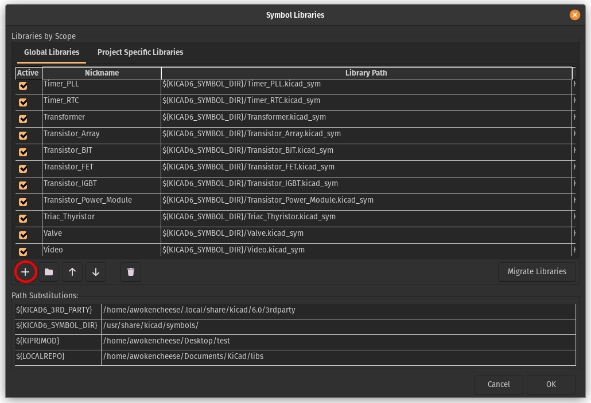

# RP2040-Zero-Kicad-Footprint
Footprint for the [RP2040 Zero dev board](https://www.waveshare.com/wiki/RP2040-Zero).

## Install
- Download the footprint and symbol files.
- Put the files somewhere they can live long-term.

### Symbols
- Open KiCad
- Click `Preferences` -> `Manage Symbol Libraries`
- Select `Global Libraries` and then `+`.

- Enter `RP2040-Zero` as Nickname.
- Enter the path to the downloaded `RP2040-Zero.kicad_sym` library as Library Path.

### Footprint
- Click `Preferences` -> `Manage Footprint Libraries`
- Select `Global Libraries` and then `+`.
- Enter `RP2040-Zero` as Nickname.
- Enter the path to the downloaded `RP2040-Zero.pretty` library as Library Path.
